# Autonomous Humanoid Robot Capstone

Welcome to the capstone project that brings together everything you've learned about Physical AI, robotics simulation, and embodied intelligence!

## 🎯 Learning Objectives

By completing this capstone, you will:

1. **Integrate Multiple Systems**: Combine ROS 2, Gazebo/Unity, NVIDIA Isaac, and Vision-Language-Action (VLA) models into a cohesive robotic system
2. **Implement Autonomous Navigation**: Apply the Nav2 stack for obstacle avoidance and path planning
3. **Apply Computer Vision**: Use deep learning for object detection and pose estimation
4. **Plan Robot Manipulation**: Create grasp plans and execute pick-and-place tasks with MoveIt 2
5. **Design Multi-Step Behaviors**: Build task planners that sequence navigation and manipulation
6. **Understand VLA Models**: Integrate state-of-the-art vision-language-action models for natural language robot control

## 📋 Prerequisites

Before starting this capstone, you should be familiar with:

- **ROS 2 Basics**: Topics, services, actions, launch files
- **Python Programming**: Object-oriented programming, async/await
- **Linux/Ubuntu**: Command line, package management
- **Robotics Fundamentals**: Kinematics, coordinate transforms, sensors
- **Machine Learning**: Basic understanding of neural networks

**Recommended Prior Modules:**
- Introduction to ROS 2
- Robot Simulation with Gazebo
- Reinforcement Learning for Navigation
- Computer Vision for Robotics

## ⏱️ Time Commitment

- **Setup**: 2 hours
- **Implementation**: 40-60 hours
- **Testing & Refinement**: 8-10 hours
- **Total**: ~50-70 hours

Plan to spend 2-3 weeks on this project working 20-25 hours per week.

## 🏗️ Project Architecture

This capstone demonstrates a complete autonomous humanoid robot system:

```mermaid
graph TB
    User[👤 User Voice Command] --> Whisper[🎤 OpenAI Whisper]
    Whisper --> VLA[🤖 VLA Model RT-1/RT-2]
    VLA --> TaskPlanner[📋 Task Planner]
    
    TaskPlanner --> NavController[🧭 Navigation Controller]
    TaskPlanner --> ManipController[🦾 Manipulation Controller]
    
    Sensors[📷 Robot Sensors] --> Isaac[🎯 NVIDIA Isaac]
    Isaac --> WorldModel[🗺️ World Model]
    
    WorldModel --> NavController
    WorldModel --> ManipController
    
    NavController --> ROS2[⚙️ ROS 2 Topics/Services]
    ManipController --> ROS2
    
    ROS2 --> Gazebo[🎮 Gazebo Simulation]
    ROS2 --> Unity[🎨 Unity Simulation]
    
    Gazebo --> Feedback[↩️ Sensor Feedback]
    Unity --> Feedback
    Feedback --> Isaac
    
    style VLA fill:#ff9,stroke:#333,stroke-width:3px
    style Isaac fill:#9f9,stroke:#333,stroke-width:2px
    style ROS2 fill:#99f,stroke:#333,stroke-width:2px
```

## 🎬 What You'll Build

### Core Features

1. **Voice Command Interface**
   - Convert speech to text using OpenAI Whisper
   - Parse natural language commands with VLA models
   - Generate executable task plans

2. **Autonomous Navigation**
   - Navigate to specified locations
   - Avoid static and dynamic obstacles
   - Replan paths in real-time

3. **Object Manipulation**
   - Detect objects using computer vision
   - Calculate grasp poses
   - Execute pick-and-place operations

4. **Multi-Step Task Execution**
   - Sequence complex tasks (e.g., "Fetch the red cube from the shelf and place it on the desk")
   - Handle failures with retry logic
   - Monitor task progress

5. **Sensor Fusion & World Modeling**
   - Combine camera, LiDAR, and IMU data
   - Maintain real-time world state
   - Track object poses

## 🛠️ Technologies Used

| Technology | Purpose | Alternative |
|------------|---------|-------------|
| **ROS 2 Humble** | Robot middleware | - |
| **Gazebo 11** | Primary simulation | Unity (optional) |
| **NVIDIA Isaac** | Computer vision AI | YOLOv8 (fallback) |
| **RT-1/RT-2 (VLA)** | Task understanding | Rule-based parser |
| **Nav2** | Navigation stack | - |
| **MoveIt 2** | Motion planning | - |
| **OpenAI Whisper** | Speech-to-text | - |

## 📚 Module Structure

This capstone is organized into the following sections:

0. **Setup** - Installation and environment configuration
1. **Introduction** - Project overview and architecture (this page)
2. **Voice Commands** - VLA integration and task planning
3. **Navigation** - Autonomous navigation with Nav2
4. **Manipulation** - Object detection and grasping
5. **Integration** - Multi-step task execution
6. **Advanced** - Unity simulation (optional)
7. **Conclusion** - Summary and next steps

## ✅ Success Criteria

You'll know you've successfully completed this capstone when you can:

- [ ] Set up the complete system in under 2 hours
- [ ] Issue a voice command and see a task plan generated
- [ ] Navigate the robot to a target location autonomously
- [ ] Detect and manipulate objects (pick and place)
- [ ] Execute a multi-step task: "Get the cube from the shelf and bring it to the desk"
- [ ] Achieve >80% success rate on pick-and-place tasks
- [ ] Explain how each system component works and integrates

## 🚀 Getting Started

Ready to begin? Head to the [Setup Guide](./00-setup/installation.md) to install all required software and dependencies.

**Estimated setup time**: 2 hours

---

**Questions or stuck?** Check the FAQ or open an issue on GitHub!
