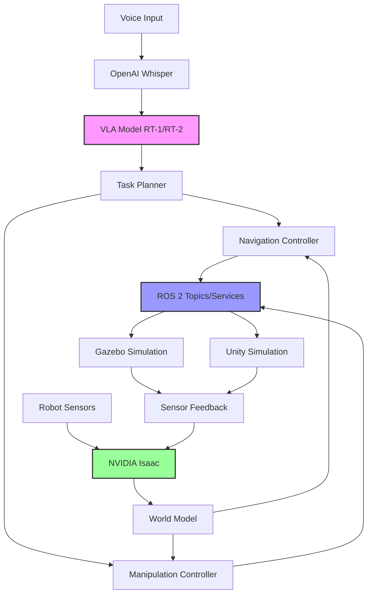

# Architectural Plan: Autonomous Humanoid Robot Capstone

**Branch**: `003-autonomous-humanoid-capstone` | **Date**: 2025-12-07 | **Spec**: [spec.md](file:///e:/gemini-cli/ai-textbook/specs/003-autonomous-humanoid-capstone/spec.md)

## Summary

Create a comprehensive educational module demonstrating an autonomous humanoid robot that processes voice commands, plans paths, navigates environments, and manipulates objects. The solution integrates four major systems: ROS 2 (robot control and communication), Gazebo/Unity (simulation), NVIDIA Isaac (computer vision and AI), and Vision-Language-Action models (task understanding). The module includes 5,000-7,000 words of educational content, complete working code examples, and hands-on tutorials validated through at least 8 peer-reviewed sources.

## 1. Scope and Dependencies

### In Scope

**Core Capabilities:**
- Voice command processing pipeline (audio → text → task plan)
- Autonomous navigation in simulated environments with dynamic obstacles
- Computer vision-based object detection and pose estimation
- Grasp planning and manipulation using articulated arms
- Multi-step task execution combining navigation and manipulation
- Real-time sensor fusion and world modeling
- Educational content creation (5,000-7,000 words)
- Complete code examples with setup instructions
- Integration testing across all four systems

**Deliverables:**
- Markdown-formatted textbook chapter with proper APA citations
- ROS 2 packages for robot control, navigation, and manipulation
- Simulation world files for Gazebo and Unity
- NVIDIA Isaac integration scripts for vision processing
- VLA model integration for task understanding
- Visualization configurations for RViz
- Installation and setup documentation
- Troubleshooting guide

### Out of Scope

**Explicitly Excluded:**
- Physical robot hardware specifications or procurement
- Manufacturing processes or mechanical design
- Low-level electronics (motor controllers, power systems)
- Advanced cognitive architectures beyond VLA models
- Non-ROS frameworks (Arduino, Raspberry Pi GPIO directly)
- Custom VLA model training (use pre-trained models)
- Multi-robot coordination or swarm behaviors
- Real-world deployment testing (simulation only)

### External Dependencies

| Dependency | Purpose | Ownership | Version | Risk Level |
|------------|---------|-----------|---------|------------|
| **ROS 2 Humble** | Robot middleware, communication | Open Robotics | 22.04 LTS | Low - Stable LTS |
| **Gazebo Classic 11** | Primary simulation environment | Open Source Robotics Foundation | 11.x | Low - Mature |
| **Unity 2022 LTS** | Alternative simulation (optional) | Unity Technologies | 2022.3+ | Medium - Licensing |
| **NVIDIA Isaac Sim** | Vision AI and physics simulation | NVIDIA | 2023.1+ | Medium - GPU required |
| **OpenAI Whisper** | Voice-to-text transcription | OpenAI | Latest | Low - API stable |
| **Pre-trained VLA** | Task understanding (RT-1/RT-2) | Google Research | Model checkpoint | High - Availability |
| **MoveIt 2** | Motion planning framework | PickNik Robotics | Humble | Low - Stable |
| **Nav2** | Navigation stack | Open Navigation | Humble | Low - Stable |
| **Ubuntu 22.04** | Operating system | Canonical | 22.04 LTS | Low - LTS support |

**Dependency Mitigation:**
- **VLA Model Availability**: Primary option RT-1; fallback to simplified task parser if model unavailable
- **NVIDIA Isaac**: Provide CPU-based vision alternative using OpenCV + YOLOv8 for users without NVIDIA GPUs
- **Unity**: Make Gazebo the primary platform; Unity as optional advanced topic

### Key Relationships



## 2. Key Decisions and Rationale

### Decision 1: ROS 2 as Central Architecture

**Options Considered:**
1. ROS 2 Humble (chosen)
2. ROS 1 Noetic
3. Custom middleware (ZeroMQ, MQTT)

**Trade-offs:**

| Option | Pros | Cons |
|--------|------|------|
| ROS 2 Humble | Industry standard, Nav2/MoveIt 2 support, modern DDS, LTS support | Steeper learning curve than ROS 1 |
| ROS 1 Noetic | Simpler, more tutorials available | End-of-life 2025, no new features |
| Custom middleware | Full control, lightweight | Reinventing wheel, no ecosystem |

**Rationale:** ROS 2 Humble provides long-term support until 2027, native integration with modern tools (Nav2, MoveIt 2, Gazebo 11), and represents current industry practice. Educational value is highest with current technology.

**Principles Applied:**
- **Integration-First**: ROS 2 provides native integration points for all required systems
- **Progressive Complexity**: Start with basic publish/subscribe, advance to services and actions
- **Hands-On Reproducibility**: Well-documented installation and extensive community support

### Decision 2: Dual Simulation Support (Gazebo Primary, Unity Optional)

**Options Considered:**
1. Gazebo only
2. Unity only
3. Both (chosen - Gazebo primary)
4. NVIDIA Isaac Sim only

**Trade-offs:**

| Option | Pros | Cons |
|--------|------|------|
| Gazebo only | Free, ROS native, lightweight | Less realistic rendering |
| Unity only | Beautiful graphics, physics | Steep learning curve, licensing |
| Both (primary Gazebo) | Best of both worlds, teaches multi-platform | More documentation needed |
| Isaac Sim only | Integrated AI, high fidelity | Requires NVIDIA GPU, complex setup |

**Rationale:** Gazebo serves as accessible entry point (free, lightweight, ROS-native). Unity section demonstrates cross-platform integration and professional visualization. This supports different learning objectives and hardware constraints.

**Principles Applied:**
- **Accessibility**: Gazebo works on most hardware
- **Progressive Complexity**: Gazebo basics → Unity advanced visualization
- **Integration-First**: Both connect via ROS 2 bridge patterns

### Decision 3: Pre-trained VLA Model (RT-1 or Simplified Parser)

**Options Considered:**
1. Train custom VLA model
2. Use pre-trained RT-1/RT-2 (chosen as primary)
3. Rule-based task parser (fallback)
4. GPT-4 Vision API

**Trade-offs:**

| Option | Pros | Cons |
|--------|------|------|
| Custom training | Perfect fit for use case | Requires massive dataset, compute, expertise |
| Pre-trained RT-1/RT-2 | State-of-art, proven capability | Model availability uncertain, checkpoint access |
| Rule-based parser | Always available, predictable | Not "real AI", limited flexibility |
| GPT-4 Vision API | Easy integration, powerful | API costs, latency, internet required |

**Rationale:** Educational goal is demonstrating VLA integration, not training. Pre-trained RT-1 showcases state-of-art; rule-based fallback ensures reproducibility. Both approaches teach valuable integration patterns.

**Principles Applied:**
- **Hands-On Reproducibility**: Provide fallback for checkpoint availability issues
- **Academic Rigor**: Cite original RT-1/RT-2 papers, explain model architecture
- **Code Quality**: Abstract VLA interface to support multiple backends

### Decision 4: Object Detection via NVIDIA Isaac (with OpenCV Fallback)

**Options Considered:**
1. NVIDIA Isaac (chosen as primary)
2. OpenCV + YOLOv8 (fallback)
3. ROS perception packages only
4. Cloud APIs (AWS Rekognition, Google Vision)

**Rationale:** Isaac demonstrates GPU-accelerated AI workflows and integrates naturally with simulation. OpenCV + YOLO fallback supports users without NVIDIA GPUs while teaching standard computer vision pipelines.

**Principles Applied:**
- **Integration-First**: Isaac tight integration with simulation and ROS 2
- **Hands-On Reproducibility**: Fallback ensures everyone can complete exercises
- **Progressive Complexity**: Start with detection, advance to pose estimation

### Decision 5: Educational Content as Markdown in Docusaurus

**Rationale:** Consistent with existing textbook infrastructure, supports code highlighting, diagrams (Mermaid), equations (LaTeX), and version control. Enables automated citation checking and plagiarism detection.

**Principles Applied:**
- **Source Quality**: Embedded APA citations with automated format checking
- **Academic Rigor**: Peer-reviewed sources tracked in bibliography database
- **Code Quality**: Syntax-highlighted code blocks with copy functionality

## 3. Interfaces and API Contracts

### 3.1 Voice Command Interface

**ROS 2 Topic**: `/voice_command`  
**Message Type**: `std_msgs/String`  
**Publisher**: Voice input node (Whisper integration)  
**Subscriber**: VLA task planner node

**Input Format:**
```json
{
  "command": "Pick up the red cube and place it on the table",
  "confidence": 0.95,
  "timestamp": "2025-12-07T21:39:10Z",
  "language": "en-US"
}
```

**Error Handling:**
- Confidence < 0.7: Request repeat via `/voice_response` topic
- Parsing failure: Return error with specific issue
- Timeout: 30 seconds, then report failure

### 3.2 Task Plan Interface

**ROS 2 Topic**: `/task_plan`  
**Message Type**: Custom `TaskPlan.msg`  
**Publisher**: VLA task planner  
**Subscriber**: Task execution coordinator

**Message Definition:**
```python
# TaskPlan.msg
Header header
string task_id
string natural_language_command
TaskStep[] steps
string status  # PENDING, EXECUTING, COMPLETED, FAILED

# TaskStep.msg
string step_type  # NAVIGATE, DETECT, GRASP, PLACE, WAIT
geometry_msgs/PoseStamped target_pose  # For navigation/manipulation
string target_object_id  # For detection/manipulation
float32 timeout_seconds
KeyValue[] parameters  # Flexible key-value pairs
```

**Contract:**
- Plan published within 2 seconds of command receipt
- Each step includes success criteria
- Steps ordered with dependencies
- Idempotent: same command → same plan (deterministic)

### 3.3 Object Detection Interface

**ROS 2 Service**: `/detect_objects`  
**Service Type**: Custom `DetectObjects.srv`  
**Server**: Isaac vision node  
**Client**: Manipulation planner

**Service Definition:**
```python
# DetectObjects.srv
# Request
sensor_msgs/Image image
string[] target_object_classes  # e.g., ["cube", "cylinder", "sphere"]
float32 confidence_threshold    # default 0.75

---
# Response
DetectedObject[] objects
bool success
string message

# DetectedObject.msg
string object_id
string class_name
geometry_msgs/Pose pose
geometry_msgs/Vector3 dimensions
float32 confidence
sensor_msgs/PointCloud2 point_cloud  # Optional, for grasp planning
```

**Performance Contract:**
- Response time: <500ms for standard scenes (<10 objects)
- Detection accuracy: >85% for trained object classes
- False positive rate: <10%

### 3.4 Navigation Interface

**ROS 2 Action**: `/navigate_to_pose`  
**Action Type**: `nav2_msgs/NavigateToPose`  
**Action Server**: Nav2 controller  
**Action Client**: Task executor

**Goal:**
```python
geometry_msgs/PoseStamped pose
string behavior_tree  # Optional, default navigation BT
```

**Feedback:**
```python
geometry_msgs/PoseStamped current_pose
float32 distance_remaining
float32 estimated_time_remaining
int32 number_of_recoveries
```

<**Result:**
```python
std_msgs/Empty  # Success
int32 error_code  # If failed
string error_message
```

**Timeout**: 5 minutes default, configurable per task  
**Retry Policy**: Up to 3 retries with recovery behaviors  
**Cancellation**: Graceful stop, return current position

### 3.5 Manipulation Interface

**ROS 2 Action**: `/manipulate_object`  
**Action Type**: Custom `ManipulateObject.action`  
**Action Server**: MoveIt 2 wrapper node  
**Action Client**: Task executor

**Goal:**
```python
string action_type  # PICK, PLACE, MOVE_TO
string object_id    # Reference to detected object
geometry_msgs/Pose target_pose  # For PLACE, MOVE_TO
string grasp_type   # top, side, custom
```

**Feedback:**
```python
string current_phase  # APPROACHING, GRASPING, LIFTING, MOVING, RELEASING
float32 progress  # 0.0 to 1.0
```

**Result:**
```python
bool success
geometry_msgs/Pose final_object_pose
string error_message  # If failed
```

**Error Codes:**
- `OBJECT_NOT_FOUND = 1`
- `IK_FAILED = 2`
- `COLLISION_DETECTED = 3`
- `GRASP_FAILED = 4`
- `PLANNING_FAILED = 5`

### 3.6 World Model Interface

**ROS 2 Topic**: `/world_model`  
**Message Type**: Custom `WorldState.msg`  
**Publisher**: World model fusion node  
**Subscriber**: All planners (navigation, manipulation, task)

**Message Definition:**
```python
# WorldState.msg
Header header
ObjectState[] objects
ObstacleMap obstacle_map
RobotState robot_state

# ObjectState.msg
string object_id
string semantic_label
geometry_msgs/Pose pose
geometry_msgs/Twist velocity  # If moving
float32 pose_confidence
```

**Update Frequency**: 10 Hz minimum  
**Latency Requirement**: <500ms from sensor data to publication

## 4. Non-Functional Requirements (NFRs) and Budgets

### 4.1 Performance

**Latency Budgets:**
- Voice command to task plan: <5 seconds (Target: 2s)
- Object detection (single frame): <500ms (Target: 200ms)
- Navigation replanning (dynamic obstacle): <1 second
- Grasp planning: <3 seconds for simple objects
- Overall task p95 latency: <60 seconds for "pick and place" task

**Throughput:**
- ROS 2 sensor data: 30 Hz (camera), 10 Hz (LiDAR), 100 Hz (IMU)
- World model updates: 10 Hz
- Task status updates: 5 Hz

**Resource Limits:**
- CPU: <80% average on 4-core system during standard operation
- RAM: <8GB total for all ROS 2 nodes
- GPU: <6GB VRAM for Isaac (if used), <2GB for YOLOv8 fallback
- Disk: <10GB for all models and world files
- Network: <10 Mbps for ROS 2 topics (single machine setup)

### 4.2 Reliability

**SLOs (Service Level Objectives):**
- Navigation success rate: >90% in structured environments
- Object detection recall: >85% for known objects in good lighting
- Manipulation success rate: >80% for primitive shapes (cubes, spheres, cylinders)
- End-to-end task completion: >70% for multi-step tasks (3+ steps)

**Error Budget:**
- Acceptable failure rate: 10% of navigation attempts
- Allowable false positives: <10% of detections
- Permitted grasp failures: <20% for known objects

**Degradation Strategy:**
- Voice confidence low: Request clarification rather than fail
- Object detection failure: Retry from different viewpoint (up to 3 attempts)
- Navigation blocked: Request human intervention after 2 retries
- Manipulation failure: Retry with adjusted grasp pose (up to 3 attempts)

### 4.3 Security

**Authentication/Authorization:**
- N/A for standalone simulation (single-user educational setup)
- If multi-user: ROS 2 SROS2 (Secure ROS 2) for encrypted communication

**Data Handling:**
- Voice commands: Not recorded permanently unless explicitly enabled for debugging
- Sensor data: Logged for debugging purposes, can be disabled
- No PII collection: Educational use only

**Secrets Management:**
- API keys (OpenAI Whisper if using API): Environment variables only
- No hardcoded credentials
- `.env` files excluded from version control

**Auditing:**
- All commands logged with timestamps to `/var/log/humanoid_robot/commands.log`
- Error events logged to `/var/log/humanoid_robot/errors.log`
- ROS 2 bag files for complete system replay

### 4.4 Cost

**Development Costs:**
- Cloud API usage (if using Whisper API): ~$0.006 per minute of audio
- GPU compute (local): Assumes user has NVIDIA GPU or uses CPU fallback
- Storage: <50GB for datasets, models, recordings

**Educational Deployment:**
- Platform: Self-hosted on student machines or university lab computers
- Licensing: All open-source except Unity (free personal license acceptable)
- Compute: Students require Ubuntu 22.04 machine with 16GB RAM recommended

**Unit Economics:** N/A (educational, not commercial)

## 5. Data Management and Migration

### 5.1 Source of Truth

| Data Type | Source of Truth | Update Frequency | Persistence |
|-----------|----------------|------------------|-------------|
| **Robot State** | ROS 2 `/robot_state` topic | 100 Hz | In-memory only |
| **World Model** | World fusion node | 10 Hz | In-memory, logged to ROS bag |
| **Object Database** | YAML configuration file | Static | Git repository |
| **Task History** | SQLite database (optional) | Per task completion | Local disk |
| **Sensor Logs** | ROS 2 bag files | On-demand recording | Local disk, retention: 7 days |

### 5.2 Schema Evolution

**Object Database Schema (objects.yaml):**
```yaml
version: "1.0"
objects:
  - id: "red_cube_01"
    class: "cube"
    dimensions: [0.05, 0.05, 0.05]  # meters
    color: "red"
    mass: 0.1  # kg
    grasp_points:
      - type: "top"
        approach: [0, 0, 1]
        offset: [0, 0, 0.025]
```

**Versioning Strategy:**
- Semantic versioning for schema (MAJOR.MINOR.PATCH)
- Backward compatibility for MINOR and PATCH changes
- Migration scripts for MAJOR version changes
- Version field in all data files

### 5.3 Migration and Rollback

**Configuration Migration:**
- Forward migration only (no rollback needed for educational content)
- Version check on load: warn if schema version mismatch
- Example: v1.0 → v1.1 adds optional "material" field, defaults to "plastic"

**Model Checkpoints:**
- VLA models: Immutable checkpoint files, use different filename for updates
- Detection models: Versioned directories (`models/yolov8/v1`, `models/yolov8/v2`)
- Rollback: Switch symbolic link to previous version

### 5.4 Data Retention

**Logging:**
- Command logs: 30 days retention locally
- Error logs: 90 days retention
- ROS bag files: User-managed, recommend 7 days for debugging
- No cloud upload (privacy and cost)

**Academic Records:**
- Code examples: Version controlled in Git indefinitely
- Documentation: Version controlled, published versions immutable
- Citations database: Permanent, version controlled

## 6. Operational Readiness

### 6.1 Observability

**Logging:**
- **Framework**: Python `logging` module, ROS 2 `rclpy.logging`
- **Levels**: DEBUG (development), INFO (default), WARN, ERROR, FATAL
- **Format**: `[timestamp] [node_name] [level] message`
- **Destinations**: 
  - Console (stdout/stderr) for immediate feedback
  - File (`~/.ros/log/`) for persistence
  - ROS bag (optional) for full system replay

**Key Log Events:**
- Voice command received with confidence score
- Task plan generated with step count
- Navigation goal set and reached/failed
- Object detection results with confidence
- Manipulation action start/complete/fail
- Error conditions with stack traces

**Metrics:**
- **ROS 2 Topics**: Use `ros2 topic hz` and `ros2 topic bw` for throughput
- **Custom Metrics** (published to `/diagnostics`):
  - Task completion rate (rolling 1-hour window)
  - Average command-to-completion latency
  - Object detection accuracy (if ground truth available)
  - Navigation path efficiency (actual vs optimal path length ratio)

**Traces:**
- ROS 2 bag recording with all topics for complete replay
- Tracing enabled via `ros2 tracing` for performance debugging

### 6.2 Alerting

**Critical Alerts (Immediate Attention):**
- ROS 2 master/daemon crash
- Simulation crash or freeze
- Safety limit exceeded (e.g., high collision forces)
- Continuous task failures (>5 in a row)

**Warning Alerts (Investigation Needed):**
- Low confidence detections (>50% below threshold in 1-minute window)
- Navigation replanning frequent (>10 times per goal)
- High CPU/memory usage (>90% for >60 seconds)
- Log file disk space low (<1GB available)

**Alerting Mechanism:**
- Console warnings (colored output)
- ROS 2 `/diagnostics` topic with ERROR level
- Optional email notification (configured via environment variable)

**On-Call:** N/A (educational environment, students debug during lab hours)

### 6.3 Runbooks

#### Runbook 1: Simulation Won't Start

**Symptoms:** Gazebo fails to launch, black screen, or error messages

**Diagnosis:**
1. Check Gazebo version: `gazebo --version` (expect 11.x)
2. Verify ROS 2 environment: `echo $ROS_DISTRO` (expect "humble")
3. Check for conflicting processes: `ps aux | grep gazebo`
4. Review logs: `cat ~/.gazebo/server.log`

**Resolution:**
1. Kill existing Gazebo: `killall -9 gzserver gzclient`
2. Source ROS 2: `source /opt/ros/humble/setup.bash`
3. Clear Gazebo cache: `rm -rf ~/.gazebo/cache`
4. Restart: `ros2 launch humanoid_sim gazebo.launch.py`

#### Runbook 2: Object Detection Not Working

**Symptoms:** Empty detection results, low confidence scores

**Diagnosis:**
1. Check camera topic: `ros2 topic echo /camera/image_raw --once`
2. Verify Isaac node running: `ros2 node list | grep isaac`
3. Check model loaded: `ros2 param get /isaac_detector model_path`
4. Inspect image quality in RViz

**Resolution:**
1. Ensure good lighting in simulation
2. Verify object in camera FOV: Open RViz, add Camera display
3. Reload detection model: `ros2 service call /isaac_detector/reload std_srvs/srv/Trigger`
4. Fallback to OpenCV: `ros2 param set /detector backend opencv`

#### Runbook 3: Navigation Gets Stuck

**Symptoms:** Robot oscillates, stops mid-path, rotates in place

**Diagnosis:**
1. Check costmaps in RViz: Add `Map` displays for `/global_costmap`, `/local_costmap`
2. Verify goal reachability: Look for goal in free space
3. Check obstacle inflation radius: May be too large
4. Review controller parameters

**Resolution:**
1. Cancel current goal: `ros2 action send_goal --cancel /navigate_to_pose`
2. Clear costmaps: `ros2 service call /global_costmap/clear_entirely_global_costmap std_srvs/srv/Empty`
3. Adjust inflation radius: `ros2 param set /local_costmap inflation_radius 0.3`
4. Send new goal through RViz "2D Nav Goal" tool

### 6.4 Deployment and Rollback

**Deployment Strategy:**
- **Textbook Content**: Git tag for each release, deploy to GitHub Pages via Actions
- **Code Packages**: Debian packages (`.deb`) for ROS 2 nodes, users install with `apt`
- **Simulation Worlds**: Packaged with code, loaded from `share` directory
- **Models**: Downloadable separately (large files), script provided

**Rollback:**
- Textbook: Revert Git tag in GitHub Pages settings
- Code: Install previous `.deb` version: `sudo apt install ros-humble-humanoid-sim=1.0.0`
- Configuration: Keep old config files in `/config/v1.0/`, switch with symlink

**Feature Flags:**
- Use ROS 2 parameters as feature flags
- Example: `use_vla_model: true` (set to `false` to use rule-based parser)
- Example: `enable_unity: false` (default to Gazebo only)
- Configured in `config/default.yaml`, overridden via launch file

**Compatibility:**
- Maintain compatibility within major version (1.x.y)
- Test on Ubuntu 22.04 with ROS 2 Humble only (primary target)
- Document any OS/ROS version dependencies clearly

## 7. Risk Analysis and Mitigation

### Risk 1: VLA Model Checkpoint Unavailable

**Impact**: HIGH - Core functionality for task understanding  
**Likelihood**: MEDIUM - Model checkpoints may be restricted or removed

**Blast Radius**: Cannot demonstrate state-of-art VLA integration, educational value reduced

**Mitigation:**
- **Primary**: Provide rule-based task parser as complete fallback
- **Secondary**: Document multiple VLA options (RT-1, RT-2, PaLM-E, open alternatives)
- **Kill Switch**: `use_vla_model` parameter defaults to `false`, requires explicit enabling
- **Guardrails**: 
  - Abstract VLA interface to support multiple backends
  - Unit tests verify both VLA and rule-based paths
  - Documentation explicitly notes VLA as "advanced/optional" if unavailable

### Risk 2: NVIDIA GPU Not Available to Students

**Impact**: MEDIUM - Reduces performance, limits Isaac Sim usage  
**Likelihood**: HIGH - Many students have AMD/Intel GPUs or laptops

**Blast Radius**: Cannot run NVIDIA Isaac, must use fallback visual processing

**Mitigation:**
- **Primary**: OpenCV + YOLOv8 CPU fallback for all vision tasks
- **Secondary**: Cloud GPU option via Google Colab (for experimentation only)
- **Kill Switch**: Auto-detect GPU type, switch backend automatically
- **Guardrails**:
  - Document minimum requirements clearly (Isaac vs CPU fallback)
  - Provide performance comparison table
  - Test all code paths on CPU-only systems

### Risk 3: Simulation Performance Too Slow

**Impact**: MEDIUM - Poor student experience, frustration  
**Likelihood**: MEDIUM - Gazebo + ROS 2 + vision can be heavy

**Blast Radius**: Students cannot run real-time; tasks take too long

**Mitigation:**
- **Primary**: Optimize simulation complexity (reduce mesh detail, fewer sensors)
- **Secondary**: Provide lightweight "fast mode" with simplified physics
- **Guardrails**:
  - Benchmark on reference hardware (4-core, 16GB RAM)
  - Set `real_time_factor` parameter for speedup/slowdown
  - Document expected performance on different hardware tiers

## 8. Evaluation and Validation

### Definition of Done

**Code:**
- [ ] All ROS 2 packages compile without warnings on Ubuntu 22.04 + Humble
- [ ] All Python code passes `flake8` and `mypy` type checking
- [ ] All C++ code passes `cpplint` (Google style)
- [ ] Unit test coverage >75% for custom nodes
- [ ] Integration tests pass for all 5 user stories (P1 and P2 required)
- [ ] Voice command to task completion demo runs successfully
- [ ] Both Gazebo and Unity (optional) simulations launch and run

**Documentation:**
- [ ] Word count 5,000-7,000 words
- [ ] Minimum 8 peer-reviewed citations (APA format)
- [ ] All code examples copy-pasteable and tested
- [ ] Installation instructions verified on clean Ubuntu 22.04 VM
- [ ] Troubleshooting section covers top 5 common issues
- [ ] All diagrams rendered correctly (Mermaid, architecture diagrams)
- [ ] No broken links (internal or external)
- [ ] Peer review completed by robotics expert

**Educational Value:**
- [ ] 90% of test users complete basic pick-and-place task
- [ ] Setup time <2 hours for users following documentation
- [ ] Accessibility: Clear language, defined terminology, no unexplained jargon
- [ ] Diversity of examples: Different objects, environments, tasks

### Output Validation

**Automated Checks:**
- CI/CD pipeline runs all unit and integration tests
- Markdown linter for documentation formatting
- Citation format checker (APA style validation)
- Link checker for external URLs
- Plagiarism detection via Turnitin or similar
- Code style checkers (flake8, cpplint, mypy)

**Manual Review:**
- Technical accuracy review by robotics PhD or industry expert
- Educational effectiveness review by instructional designer
- Code review focusing on clarity and best practices
- Peer review of citations for relevance and quality
- User testing with 5-10 students from target audience

### Safety Considerations

**Simulation Safety:**
- Collision detection enabled in all simulation environments
- Force limits configured to prevent unrealistic behaviors
- Emergency stop functionality via `Ctrl+C` or `/emergency_stop` service

**Code Safety:**
- No `sudo` commands required during normal operation
- All file I/O in user home directory or `/tmp`
- No network connections beyond localhost (except optional Whisper API)
- Input validation for all voice commands and task parameters

## 9. Architectural Decision Records (ADRs)

The following significant architectural decisions should be documented as ADRs:

1. **ADR-001: Use ROS 2 Humble as Middleware**
   - Document: Why ROS 2 over ROS 1, why Humble over other distributions
   - Run: `/sp.adr ros2-humble-middleware`

2. **ADR-002: Dual Simulation Strategy (Gazebo Primary, Unity Optional)**
   - Document: Trade-offs between single vs dual simulation support
   - Run: `/sp.adr dual-simulation-support`

3. **ADR-003: VLA Model Integration with Rule-Based Fallback**
   - Document: Approach to handling VLA model availability risk
   - Run: `/sp.adr vla-model-strategy`

4. **ADR-004: Object Detection Backend Abstraction (Isaac/OpenCV)**
   - Document: Architecture for swappable vision backends
   - Run: `/sp.adr vision-backend-abstraction`

---

**Next Steps:**
1. Review and approve this architectural plan
2. Create ADRs for the 4 significant decisions above
3. Proceed to Phase 0: Research (gather peer-reviewed sources, study RT-1/RT-2 papers)
4. Proceed to Phase 1: Design (data model, quickstart guide, API contracts)
5. Execute `/sp.tasks` to generate detailed implementation tasks
